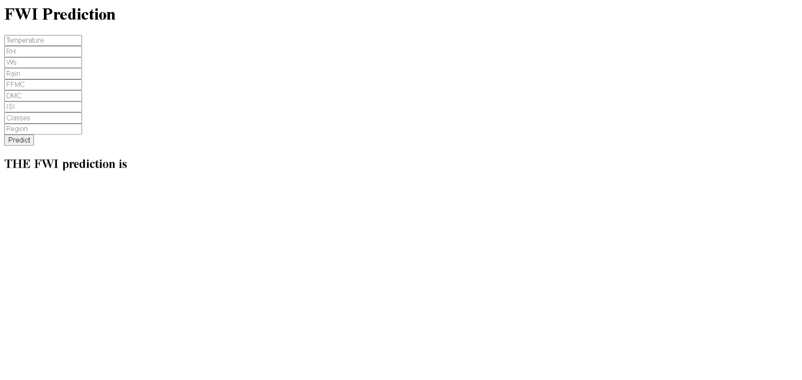

#  Algerian Forest Fire Prediction

A machine learning web application that predicts the **Fire Weather Index (FWI)** using meteorological and fire-weather observations from the Algerian Forest Fires dataset.

The project uses **Ridge Regression** with feature scaling and is deployed through a **Flask** web application.

## Live Demo
https://algerian-forest-fire-prediction-acgn.onrender.com/

## Application Preview


##  Overview

The Algerian Forest Fires dataset contains observations from two regions of Algeria:

- Bejaia
- Sidi Bel-Abbes

The dataset contains weather conditions and Fire Weather Index (FWI) components collected during the summer of 2012.

In this project, the data is cleaned, explored, transformed, and used to train multiple regression models. Ridge Regression was selected for the final application based on its performance.

The trained model is integrated into a Flask application where users can enter weather and fire-weather measurements and receive an FWI prediction.

##  Machine Learning Workflow

The project follows this workflow:

1. Data collection and cleaning
2. Exploratory Data Analysis (EDA)
3. Feature engineering
4. Handling missing values
5. Encoding categorical variables
6. Correlation analysis
7. Multicollinearity-based feature selection
8. Train/test split
9. Feature standardization using `StandardScaler`
10. Regression model training and comparison
11. Model evaluation
12. Flask deployment

##  Features Used

The final model uses the following features:

| Feature | Description |
|---|---|
| Temperature | Temperature at noon in °C |
| RH | Relative humidity (%) |
| Ws | Wind speed (km/h) |
| Rain | Total daily rainfall (mm) |
| FFMC | Fine Fuel Moisture Code |
| DMC | Duff Moisture Code |
| ISI | Initial Spread Index |
| Classes | Fire / Not Fire encoded numerically |
| Region | Encoded geographical region |

### Target

**FWI — Fire Weather Index**

The model predicts the numerical FWI value based on the input features.

##  Models Evaluated

Several regression models were evaluated during model development:

- Linear Regression
- Lasso Regression
- LassoCV
- Ridge Regression
- RidgeCV
- ElasticNet Regression
- ElasticNetCV

Ridge Regression was selected for the final application.

### Ridge Regression Performance

On the test split used during model training:

- **Mean Absolute Error (MAE):** 0.564
- **R² Score:** 0.9843

These results indicate that the model performed well on the held-out test data.

##  Tech Stack

- Python
- Flask
- NumPy
- Pandas
- Scikit-learn
- Matplotlib
- Seaborn
- Jupyter Notebook
- HTML

##  Project Structure

```text
algerian-forest-fire-prediction/
│
├── .ebextensions/
│   └── python.config
│
├── dataset/
│   └── Algerian_forest_fires_cleaned_dataset.csv
│
├── models/
│   ├── ridge.pkl
│   └── scaler.pkl
│
├── notebooks/
│   ├── 2.0-EDA And FE Algerian Forest Fires.ipynb
│   └── 3.0-Model Training.ipynb
│
├── templates/
│   ├── home.html
│   └── index.html
│
├── application.py
├── requirements.txt
├── .gitignore
└── README.md
```
##  Getting Started

### Prerequisites

- Python 3.8+
- pip

### Installation

1. Clone the repository:

```bash
git clone https://github.com/Nishad016/algerian-forest-fire-prediction.git
cd algerian-forest-fire-prediction
```
2. Create a virtual environment:

```bash
python -m venv venv
```
3. Activate the virtual environment.
#### Windows:
```bash
venv\Scripts\activate
```
#### Linux/macOS:
```bash
source venv/bin/activate
```
4. Install the required dependencies:
```bash
pip install -r requirements.txt
```
### Run the Application
```bash
python application.py
```
Open the application in your browser at:
```bash
http://127.0.0.1:5000/
```
## How It Works
The application accepts meteorological and fire-weather parameters through a web interface.

The input data is:

1. Collected through the Flask form
2. Transformed into the required feature format
3. Standardized using the trained StandardScaler
4. Passed to the trained Ridge Regression model
5. Used to generate the predicted Fire Weather Index (FWI)

## Model Performance
The final Ridge Regression model achieved the following performance on the test split:

| Metric              |  Score |
| ------------------- | -----: |
| R² Score            | 0.9843 |
| Mean Absolute Error |  0.564 |

The high R² score indicates that the model explains a large proportion of the variation in FWI on the held-out test data.

## Future Improvements
- Improve the frontend design and user experience
- Add stronger input validation and error handling
- Experiment with additional regression and ensemble models
- Add automated model retraining
- Add unit and integration tests
- Containerize the application using Docker
- Add CI/CD with GitHub Actions
- Deploy the application to a production cloud environment


